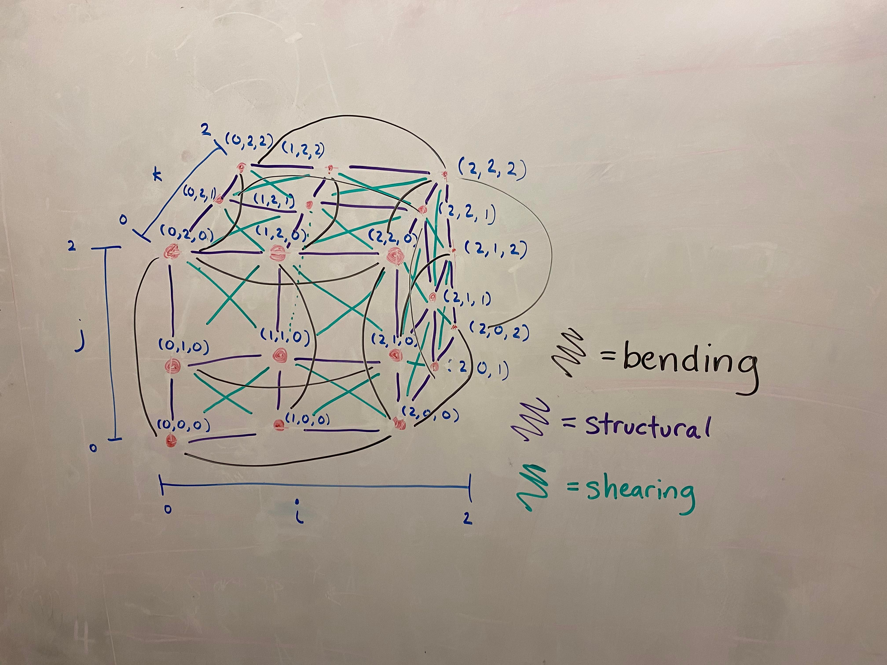
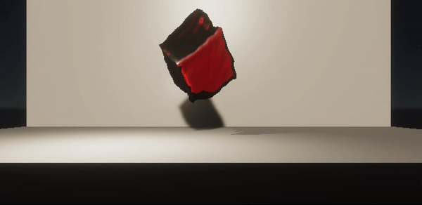

<!-- # Milestone

Jello, again!

## Accomplishments

For our project, we chose to learn Unity due to its popularity, capabilities in physical 
simulation and rendering, and potential need for efficiency.

So far, we've implemented a Jello simulation using a mass-spring model. The 
model creates a 3D grid with masses at each vertex and springs connecting
the masses. We chose the springs (structural, bending, and shearing) by extrapolating 
the structure of our cloth simulation. Afterwards, we implemented the mesh generation 
for this model, which creates a triangle mesh from the masses' vertices.

{:style="display:block; margin-left: auto; margin-right: auto; width:30%;"}

Then, we worked with Unity to take our mesh and render it to look like Jello. This took 
some experimenting with the Unity materials and rendering pipelines.

## Preliminary Results
Here's the current state of our simulation and rendering! We added in a listener for 
keypresses which makes the Jello jump upwards.

{:style="display:block; margin-left: auto; margin-right: auto; width:50%;"}

## Reflection
Overall, we thought that our model works well, but there's a couple of issues with the model and our rendering that we'd
want to improve on for our final submission.
- The mass-spring model can be unstable at times, especially when high forces are exerted
- Our render isn't as transparent and realistic as we'd like

Also, our goal is to eventually try using a material point method or other more complicated method to render the
Jello and support collisions with rigid bodies. For example, we want to simulate a bullet striking through
the Jello cube.  -->

## Overview
We originally found demos on ShaderToy rendering hair-like structures based on Kajiya-Kay model. But later, due to difficulties in simulating physical properties directly with a shader, we decided to not use ShaderToy temporarily, and focus solely on physical simulation of hair. After physical model being able to work properly, we might consider reapplying it for rendering. We went through many papers and determined the physical model for hair simulation. A model is being built out of the cloth structure in Homework 4 (so that the cloth becomes hairy).

## Hair Physical Model

In our formulation, hair is modeled as a serial succession of point masses, connected with springs. First, edge springs are between every 2 neighboring particles. Second, bending springs connect every particle to other particles 2 edges away from it. Third, torsion springs connects every particle to other particles 3 edges away from it. Fourth, for every 4 consecutive particles, the above springs form a tetrahedron. Between every pair of opposite edges of the tetrahedron, the distance between the straight lines are calculated, and a spring-like repelling force is exerted on the edges according to the distance.

The elastic force on the spring between 2 particles $$p_1, p_2$$ exerted on particle $$p_1$$ is

$$ F_{12} = k_s \frac{\|p_2 - p_1\| - l_0}{\|p_2 - p_1\|} (p_2 - p_1) $$

where $$k_s$$ is the spring constant and $$l_0$$ is the rest length. Note that the numerator in the fraction could be negative, in which case the force is in the opposite direction.

The elastic force on the tetrahedral altitude spring between edges $$p_1p_2$$ and $$p_3p_4$$ exerted on $$p_1p_2$$ is

 $$F_{12-34} = k_s \frac{\|n\| - l_0}{\|n\|} n $$

where $$n = \frac{(a \times b) \cdot c}{\|a \times b\|^2}$$is the directed distance from edge $$p_1p_2$$ to $$p_3p_4$$, where $$a = p_2 - p_1$$, $$b = p_4 - p_3$$, $$c = p_3 - p_1$$. $$k_s$$  and $$l_0$$ have the same meaning as above.

<!-- <iframe width="560" height="315" src="https://www.youtube.com/embed/4n5AfHYST6E" title="YouTube video player" frameborder="0" allow="accelerometer; autoplay; clipboard-write; encrypted-media; gyroscope; picture-in-picture; web-share" allowfullscreen></iframe> -->

<iframe width="560" height="315" src="https://www.youtube.com/embed/atkGCNHlKOA?si=_P7x_AtHHEoVeqwA" title="YouTube video player" frameborder="0" allow="accelerometer; autoplay; clipboard-write; encrypted-media; gyroscope; picture-in-picture; web-share" referrerpolicy="strict-origin-when-cross-origin" allowfullscreen></iframe>

## References: 
[Selle et al., 2008: A Mass Spring Model for Hair Simulation](https://physbam.stanford.edu/~mlentine/images/hair.pdf) 

[Yao Lyu, 2016: Hair Simulation Based on Mass Spring System](https://nccastaff.bournemouth.ac.uk/jmacey/MastersProject/MSc17/05/1.pdf)
